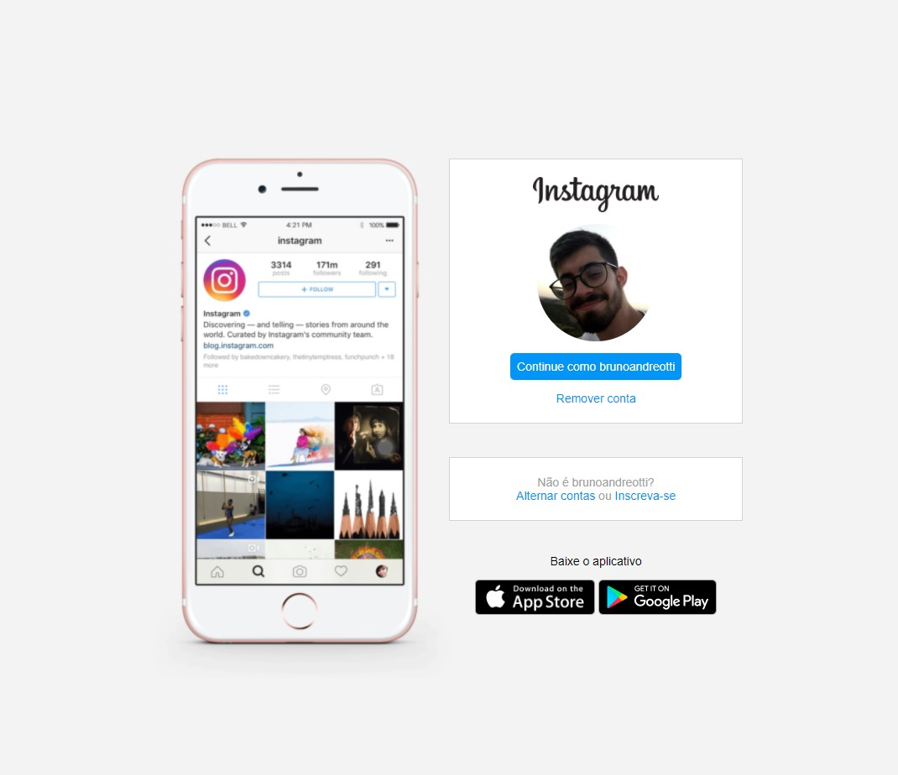
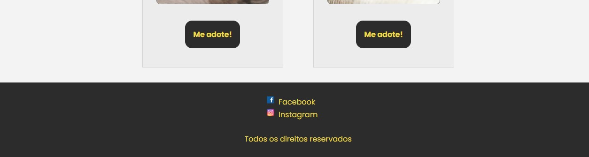
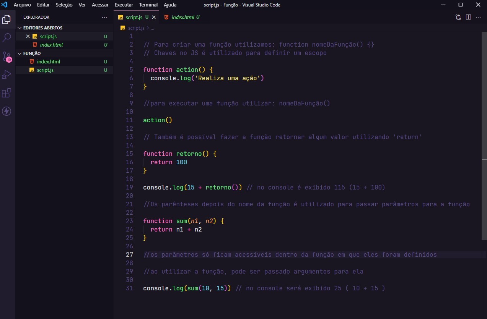
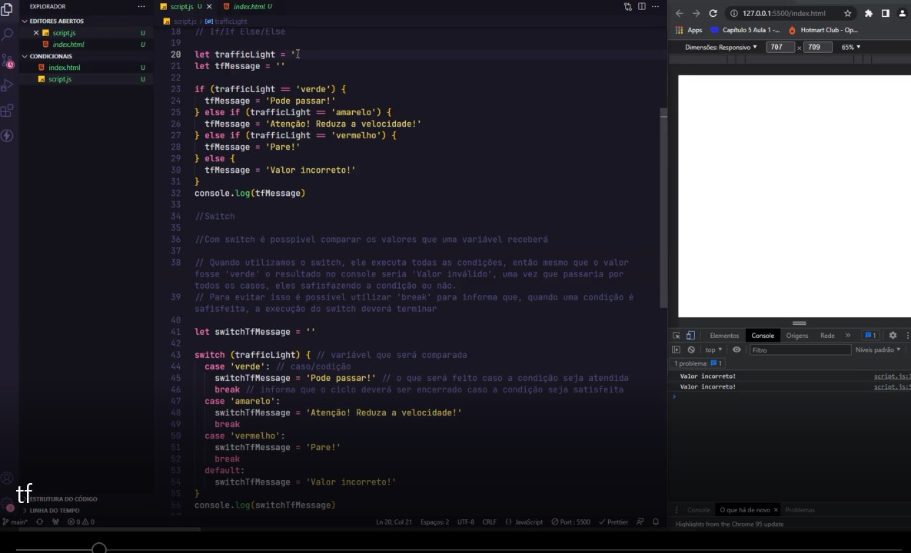

<h1 align="center"> Desafio 30 dias de programação </h1>

## Dia 1 (Clone Login Instagram)

 

## Dia 2 (Treino FlexBox Zombies)

 

## Dia 3 (Consultor de CEP)

 

## Dia 4 (Rodapé AdoteAqui)

 

## Dia 5 (Estudo JS)

 

## Dia 6 (Estudo JS)

 
